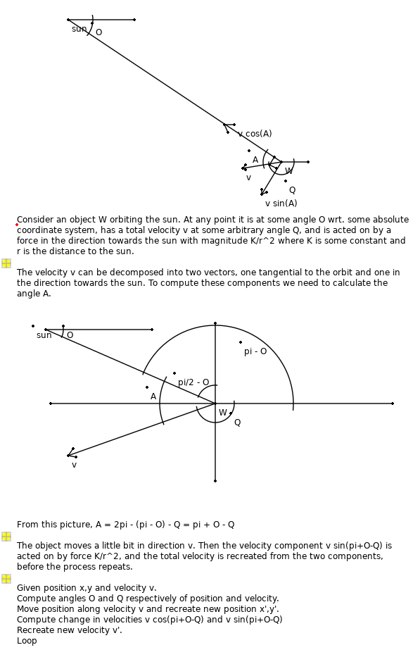

## Kartik's mission

Since 2015, I've been working towards a computer (a set of software above some
substrate) that can fit in a single human (programmer's) head. You shouldn't
need to understand its internals to use it, but it should reward curiosity.

Principles:
* It has to be useful. Principles aren't useful by themselves.
* It doesn't have to do everything. It will coexist with more conventional
  computers.
* All the software on it must be trivial to build.
* The software should comprise a minimal number of zones of ownership. (A zone
  of ownership is a small group of people who are knowledgeable to diagnose
  and fix any reported issues.)

One major implication: It should have minimal dependencies. Dependencies are
often provided by others, emphasize capabilities over clarity, and add moving
parts that complicate the build.

Mechanisms I've explored in the past that seem like important ingredients:
* Version control. The history of a codebase helps to explain its design
  choices.
* [Layers](http://akkartik.name/post/wart-layers), a way of organizing
  programs akin to literate programming. We represent runnable versions of
  subsets of a program's features (often exactly its early versions) in the
  codebase. Subsets of a program's layers build working, internally consistent
  apps.
* [White-box tests](http://akkartik.name/post/tracing-tests), a way to write
  tests while keeping the codebase supple and allowing it to be rewritten.
* Dependency injection. Support swapping out real hardware for tests.
  Examples: [1](https://github.com/akkartik/mu1#readme), [2](https://github.com/akkartik/lines.love/blob/main/app.lua)
* The ability to modify programs without needing to restart them.
* Forking apps to delete features rather than constantly accreting features
  and complexity.

Things I _don't_ care about:
* Conventional best practices. SOLID, etc. The fantasy of software engineering.
* Large-scale software.
* Experiment. Programming is not a science, or even a natural "science". There
  are too many variables to permit controlled trials.
* Imposing stylistic restrictions on others. Disallowing `goto`, linters,
  style guides, etc. They're ineffectual with the wrong programming habits,
  and they're unimportant with the right habits.

Some recent projects:
* A text editor where you can seamlessly insert line drawings.
  
* [A note-taking app](pensieve.md) made of many text editor widgets arranged
  in a non-overlapping 2D surface.
* The ability to [modify such apps while using them](https://merveilles.town/@akkartik/108933336531898243)
  without needing any additional tools to browse source code, browse graphical
  debug logs of the program, etc.
* The ability to [modify such apps without restarting them](https://spectra.video/w/wkDB5fsjBNBbsqKXGhGzwT).

The goal isn't just research prototypes but software intended to be used all
the time. So far the first project (the text editor) seems robust enough to
meet that bar. It is missing features, but the features it does have seem
reliable.
