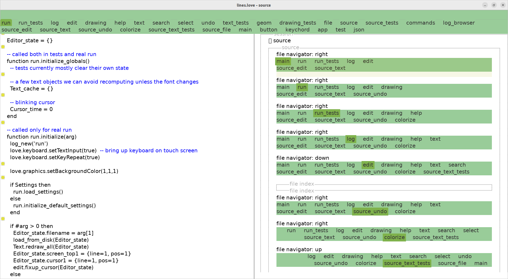

## pensieve.love: Kartik's note-taking app

Built to manage 20 years worth of notes and email (9GB), using as little code
as possible.

[Demo video, 5 minutes.](https://spectra.video/w/051fef50-a121-40c0-bf3c-ee0730fb4a07)

[Try it out.](https://git.sr.ht/~akkartik/pensieve.love)

Features:
* Browse notes on an infinite 2D surface. Non-overlapping rectangles are a
  sweet spot of comfort and complexity.
* Capture notes with a parallel app/UI that provides a blank slate free from
  distractions.
* A graphical shell with a powerful and extensible array of commands, that
  usually create columns of notes.
* An expressive set of relationships between individual notes that allows the
  graph of notes to be browsed in many ways. For example, one column may show
  all of a note's immediate neighbors while the next may start traversing from
  it along a single dimension.
* Full-disk search implemented in 200 LoC (no search index).
* Hyperlinks.
* Built with as little code as possible all the way up from machine code. The
  app itself requires 13kLoC. The programming language ([Lua](https://www.lua.org))
  it uses requires 12kLoC of C. The OS and graphics libraries ([LÖVE](https://love2d.org))
  are more complex but relatively parsimonious compared to alternatives.
* Cross-platform (thanks to LÖVE)
* Lots of tests for core pieces like the text editor.
* Hosts an editing environment to modify its own source code and browse logs
  of past execution.
* Logs include an extensible mechanism to graphically render many kinds of
  data. Here I'm debugging its menu, and you can see a log of keystrokes on
  the right half of the window.
  
